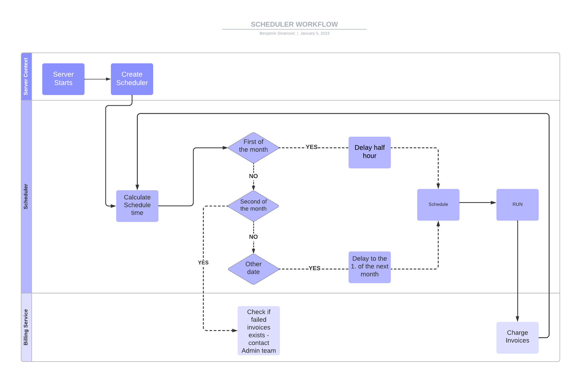

## Antaeus

Antaeus (/ænˈtiːəs/), in Greek mythology, a giant of Libya, the son of the sea god Poseidon and the Earth goddess Gaia. He compelled all strangers who were passing through the country to wrestle with him. Whenever Antaeus touched the Earth (his mother), his strength was renewed, so that even if thrown to the ground, he was invincible. Heracles, in combat with him, discovered the source of his strength and, lifting him up from Earth, crushed him to death.

Welcome to our challenge.

## The challenge

As most "Software as a Service" (SaaS) companies, Pleo needs to charge a subscription fee every month. Our database contains a few invoices for the different markets in which we operate. Your task is to build the logic that will schedule payment of those invoices on the first of the month. While this may seem simple, there is space for some decisions to be taken and you will be expected to justify them.

## Instructions

Fork this repo with your solution. Ideally, we'd like to see your progression through commits, and don't forget to update the README.md to explain your thought process.

Please let us know how long the challenge takes you. We're not looking for how speedy or lengthy you are. It's just really to give us a clearer idea of what you've produced in the time you decided to take. Feel free to go as big or as small as you want.

## Developing

Requirements:
- \>= Java 11 environment

Open the project using your favorite text editor. If you are using IntelliJ, you can open the `build.gradle.kts` file and it is gonna setup the project in the IDE for you.

### Building

```
./gradlew build
```

### Running

There are 2 options for running Anteus. You either need libsqlite3 or docker. Docker is easier but requires some docker knowledge. We do recommend docker though.

*Running Natively*

Native java with sqlite (requires libsqlite3):

If you use homebrew on MacOS `brew install sqlite`.

```
./gradlew run
```

*Running through docker*

Install docker for your platform

```
docker build -t antaeus
docker run antaeus
```

### App Structure
The code given is structured as follows. Feel free however to modify the structure to fit your needs.
```
├── buildSrc
|  | gradle build scripts and project wide dependency declarations
|  └ src/main/kotlin/utils.kt 
|      Dependencies
|
├── pleo-antaeus-app
|       main() & initialization
|
├── pleo-antaeus-core
|       This is probably where you will introduce most of your new code.
|       Pay attention to the PaymentProvider and BillingService class.
|
├── pleo-antaeus-data
|       Module interfacing with the database. Contains the database 
|       models, mappings and access layer.
|
├── pleo-antaeus-models
|       Definition of the Internal and API models used throughout the
|       application.
|
└── pleo-antaeus-rest
        Entry point for HTTP REST API. This is where the routes are defined.
```

### Main Libraries and dependencies
* [Exposed](https://github.com/JetBrains/Exposed) - DSL for type-safe SQL
* [Javalin](https://javalin.io/) - Simple web framework (for REST)
* [kotlin-logging](https://github.com/MicroUtils/kotlin-logging) - Simple logging framework for Kotlin
* [JUnit 5](https://junit.org/junit5/) - Testing framework
* [Mockk](https://mockk.io/) - Mocking library
* [Sqlite3](https://sqlite.org/index.html) - Database storage engine

Happy hacking 😁!

## NOTES

### INITIAL DECISIONS:

- This project will be treated as a mix of a task and a real system
- The reason for statement above is to be pragmatic and to avoid the loop of over-engineering the task
- It will have **SOME** practices from real systems to show my way of thinking

### ASSUMPTIONS

- The microservice is running on multiple servers
- System doesn't have constant high throughput, because invoices are handled periodically (transactions would be the opposite) 
- For invoices it is important to be charged on 1. of the month, the real time execution isn't that important, so the focus won't be on optimisation
- Pleo has established excellent SLA with payment provider regarding the rate-limit of requests (because of transactions microservice), so don't have to worry about it


### BUSINESS DECISIONS
1. **TIMEZONES**
- PROBLEM:
  - There are multiple currencies in the project which indicates customers are in different countries/continents. 
  - Is there a need to handle charging of customers depending on the timezone?
  - Does the pricing depend on the number of transactions in month? If yes the timezone will matter.
- SOLUTION:
    - After looking at the PLEO [documentation](https://www.pleo.io/en/pricing), the charging of the PLEO services is based on the number of customer and administrative transactions 
    - PLEO Sales/Administrative team will prepare the bills before the every first of the month
2. **PENDING INVOICES**
- PROBLEM:
  - What are representing the PENDING INVOICES?
- SOLUTION:
  - As mentioned in the timezone problem the Sales/Administrative team will prepare the bills before and enter them into the system using admin tool which will in the background insert those bills in the Invoice table and mark them as PENDING.
  - The solution is to get those invoices from database on every 1. of the month and pass them to the payment provider

#### ARCHITECTURE DECISIONS

1. SCHEDULER 
- PROBLEM:
  - For scheduling payments there are two options:
    1. Java util ScheduledExecutorService
    2. [Quartz](http://www.quartz-scheduler.org/) a richly featured, open source job scheduling library
- SOLUTION
    - The ScheduledExecutorService will be used for this task to avoid overhead of importing the library and to keep it simple
    - However, I think Quartz is a great solution since it provides a lot of [configuration](https://github.com/quartz-scheduler/quartz/blob/master/docs/configuration.adoc) for managing the threads/coroutines
    - If PLEO has a lot of scheduling in their microservices I think it would be great even to have a custom library such as quartz

2. **SCHEDULER IMPLEMENTATION**
- PROBLEM:
  - When and how to charge the customers?
- SOLUTION:
  - Scheduler will be initialised every time the server starts (deployment, crash..)
  - It could happen that someone deployed or server crashed in the middle of charging invoices
  - In that case scheduler will gracefully shut down, but still could fail to charge a lot of invoices. It will normally continue to charge after the server starts.
  - As time of charging doesn't matter, the scheduling iteration will start at 01:00 AM at every 1. of the month
  - After the charging iteration finish, next one will be rescheduled half hour later
  - The reason behind that is there could be cases of failed transactions due to Network or other errors. By making a new iteration of charging, those invoices will be re-processed
  - Look into the Diagram below
  
3. **ASSURE CUSTOMER NOT CHARGED MULTIPLE TIMES**
- PROBLEM:
  - How to assure customer isn't charged multiple times for same invoice?
- SOLUTION:
  - Assuming the system is running on multiple servers, there are need for locks on customerID
  - In real system the distributed caching system could be used (e.g Redis). In this project, the SqlLite will serve the purpose
  - There is an edge case where the payment provider charges the customer, but updating the invoice status to PAID failed due to database error
  - Since the speed isn't that important, the operation of updating the invoice to PAID will be under retry mechanism with 10 retries and 10s delay
  - Mostly it will past on the first iteration
  - If the retry mechanism fails the admins will be notified with High alert since this is infrastructure problem, and other parts of app won't work as well

#### SCHEDULER DIAGRAM


#### Nice to Have

1. Better handling of try-catch mechanism, ideally something globally that will handle it
2. Less comments 
3. Test to dive deeper into scheduler
4. Endpoint to manually charge the invoices (for admin TOOl when the system fails to charge)
5. Rethink the design patterns
6. Use Coroutines to optimise

